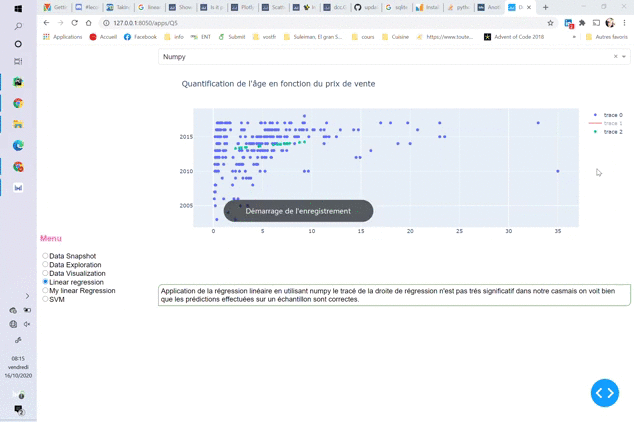

## Architecture logiciel
Le projet à été effectué sur ubuntu 18.04 avec
 - [Python][1] (3.8) 
 - [Dash][2] (1.16.2)
 - [scikit-learn][3] (0.23.2)

### Heroku
Le projet est hébergé sur Heroku :
      https://visualistaion-tp.herokuapp.com/ 
    
## Projet

Présentation d'un dashboard exploitant
les données de carData.csv.

Choix de la voiture à acheté en étudiant les différents prix du marché.

### Regression linéaire

Etude de la quantification de l'année de vente de la voiture
par rapport au prix de vente en utilisant les algorithmes 
de régression linéaire (numpy, scipy, sklearn)
et en créant le notre.

Comparaison entre tous ces algorithmes de regréssion et avec SVM.

SVM se trouve être plus efficace pour ces données.

